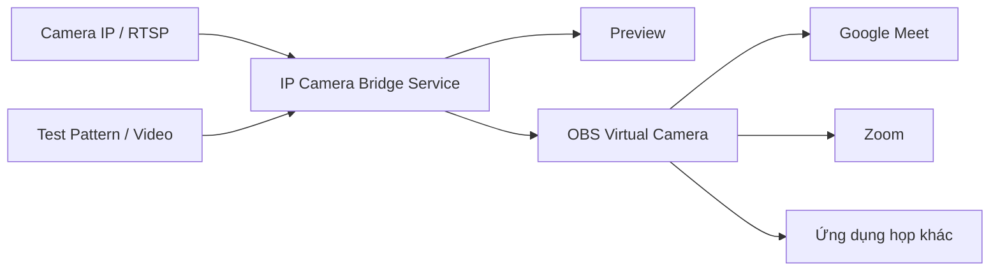

# IP Camera Bridge

> Biến camera IP/RTSP thành **OBS Virtual Camera** để sử dụng trong Google Meet, Zoom và các ứng dụng họp trên Windows.


IP Camera Bridge nhận hình ảnh từ RTSP, video hoặc Test Pattern, hiển thị preview và xuất một camera đã chọn qua thiết bị **OBS Virtual Camera**. Ứng dụng hỗ trợ tối đa 16 nguồn, tự kết nối lại khi mất mạng và có thể hoạt động nền cùng Windows.

## Mục lục

- [Tính năng](#tính-năng)
- [Cách hoạt động](#cách-hoạt-động)
- [Yêu cầu hệ thống](#yêu-cầu-hệ-thống)
- [Cài đặt](#cài-đặt)
- [Thiết lập lần đầu](#thiết-lập-lần-đầu)
- [Quét camera trong LAN](#quét-camera-trong-lan)
- [Thêm camera RTSP thủ công](#thêm-camera-rtsp-thủ-công)
- [Sử dụng nhiều camera](#sử-dụng-nhiều-camera)
- [Sử dụng trong Google Meet và Zoom](#sử-dụng-trong-google-meet-và-zoom)
- [Chạy cùng Windows](#chạy-cùng-windows)
- [Bảo mật và dữ liệu](#bảo-mật-và-dữ-liệu)
- [Xử lý lỗi](#xử-lý-lỗi)
- [Chạy từ mã nguồn](#chạy-từ-mã-nguồn)
- [Đóng gói](#đóng-gói)

## Tính năng

| Chức năng | Mô tả |
|---|---|
| Nguồn RTSP | Nhận H.264/H.265 và các luồng video được FFmpeg/PyAV hỗ trợ qua RTSP TCP. |

| Quét LAN | Nhập IP bắt đầu và IP kết thúc; chỉ quét RTSP trong dải đó, tối đa 1024 địa chỉ.|

| Nhiều camera | Lưu tối đa 16 nguồn và chọn một camera để xuất tại mỗi thời điểm.|

| Webcam ảo | Xuất hình qua **OBS Virtual Camera** cho Meet, Zoom và ứng dụng tương thích webcam Windows.|

| Windows Service | Tự nhận camera khi Windows khởi động và tự bật webcam sau khi người dùng đăng nhập. |
| Tự phục hồi | Liên tục thử kết nối lại khi camera hoặc mạng bị gián đoạn. |
| Bảo vệ mật khẩu | Mã hóa cấu hình camera bằng Windows DPAPI; không ghi mật khẩu vào log. |
| Test Pattern | Kiểm tra preview và webcam ảo khi không truy cập được mạng camera. |
| Video File | Dùng file video làm nguồn thử nghiệm, phát lặp và không phát âm thanh. |

> [!NOTE]
> Ứng dụng chỉ xử lý **hình ảnh**. Hãy chọn microphone riêng trong phần cài đặt âm thanh của ứng dụng họp.

## Cách hoạt động



OBS cung cấp driver webcam ảo. IP Camera Bridge gửi trực tiếp hình ảnh vào driver đó, vì vậy **không cần mở OBS Studio** và không cần bấm **Start Virtual Camera** trong OBS.

## Yêu cầu hệ thống

- Windows 10 phiên bản 1809 trở lên hoặc Windows 11, x64.
- Máy tính và camera nằm trong cùng mạng hoặc có tuyến mạng truy cập được camera.
- Cổng RTSP của camera, thường là TCP `554`, không bị firewall chặn.
- OBS Studio để cung cấp thiết bị **OBS Virtual Camera**.
- Quyền quản trị khi cài đặt hoặc gỡ Windows Service.

Máy sử dụng bộ cài không cần cài Python. Bộ cài có tùy chọn cài kèm OBS Studio nếu chưa phát hiện OBS trên máy.

## Cài đặt

### Cài mới

1. Nhận file `IPCameraBridge-Setup.exe` từ người phát hành.
2. Mở file theo cách bình thường, không chọn **Run as administrator**.
3. Chọn **Yes** khi Windows yêu cầu quyền quản trị.
4. Nếu máy chưa có OBS, giữ tùy chọn **Cài OBS Studio**.
5. Trang hoàn tất thông báo cài đặt thành công. Giữ **Mở IP Camera Bridge ngay** rồi bấm **Finish**, hoặc mở biểu tượng **IP Camera Bridge** trên Desktop.

Bộ cài tạo biểu tượng IP Camera Bridge trên Desktop. Khi cài kèm OBS, biểu tượng OBS mới tạo được dọn khỏi Desktop; biểu tượng OBS đã có từ trước được giữ nguyên.

> [!WARNING]
> Bộ cài hiện chưa có chữ ký số của nhà phát hành. Windows SmartScreen có thể yêu cầu chọn **More info → Run anyway**. Chỉ chạy file nhận từ nguồn bạn tin tưởng và có SHA-256 khớp với file `.sha256` đi kèm.

### Nâng cấp

Phiên bản hiện tại chưa ghi đè trực tiếp bản đang cài:

1. Mở **Settings → Apps → Installed apps**.
2. Gỡ **IP Camera Bridge**.
3. Khi được hỏi có xóa camera và mật khẩu hay không, chọn **No** để giữ dữ liệu.
4. Chạy bộ cài mới bằng cùng tài khoản Windows.

### Gỡ cài đặt

Gỡ ứng dụng trong **Settings → Apps → Installed apps**. OBS Studio là thành phần độc lập nên không bị gỡ cùng IP Camera Bridge.

## Thiết lập lần đầu

1. **Thêm camera:** quét LAN hoặc nhập IP / URL RTSP, tên đăng nhập và mật khẩu riêng.
2. **Kết nối và sử dụng:** tool lưu cấu hình nếu checkbox **Lưu cấu hình** được bật, kết nối camera rồi tự bật webcam ảo khi đã nhận hình.
3. **Trong Meet / Zoom:** chọn **OBS Virtual Camera**.

Bật **Tự chạy khi đăng nhập Windows** trước khi bấm **Kết nối và sử dụng** để ghi nhớ lựa chọn. Service nhận camera khi Windows khởi động; bộ phát chạy sau đăng nhập.

**Lưu cấu hình** mặc định bật. Bỏ chọn để dùng tạm đến khi Windows Service khởi động lại; cấu hình đã lưu trước đó không bị xóa hay ghi đè. Bật tự chạy Windows sẽ tự bật lưu cấu hình. Sau khi chỉnh checkbox, bấm **Kết nối và sử dụng** để áp dụng.

Màn hình chính hiển thị trạng thái camera và webcam. **Đầu ra đã chọn** chỉ là lựa chọn nguồn; **Đang phát** chỉ hiện sau khi bộ phát báo hoạt động và nguồn đã kết nối. Bấm **Xem hình camera** khi cần kiểm tra hình, preview mặc định được ẩn.

Ô mật khẩu luôn nhập được. Để trống sẽ giữ mật khẩu cũ; nhập mới sẽ thay mật khẩu khi lưu. Muốn xóa mật khẩu, dùng **Tác vụ khác → Xóa mật khẩu đã lưu**, sau đó lưu.

Không có mạng camera? Dùng **Tác vụ khác → Thêm camera thử (Test Pattern)** rồi **Kết nối và sử dụng**. Khi thêm camera thật, RTSP là nguồn mặc định.

## Quét camera trong LAN

Nút **Quét camera LAN** nằm trong phần **1. Danh sách camera**.

1. Bấm **Quét camera LAN**. Chọn một card mạng để gợi ý dải IP hoặc chọn **Nhập dải IP thủ công**. Windows quyết định đường đi mạng theo bảng định tuyến.
2. Nhập **IP bắt đầu**, ví dụ `192.168.100.1`, và **IP kết thúc**, ví dụ `192.168.100.254`. Quét bao gồm hai đầu, tối đa 1024 địa chỉ qua cổng 554; khác VLAN cần routing/firewall cho phép. Không gửi probe ONVIF multicast ra ngoài dải này.
3. Bấm **Bắt đầu quét**, theo dõi tiến độ; có thể bấm **Dừng quét LAN**.
4. Tick các thiết bị cần thêm, kiểm tra **Mẫu đường dẫn** rồi bấm **Thêm camera đã tick**.
5. URL RTSP được tạo tự động theo mẫu. Mặc định dành cho i-PRO / Panasonic: `/Src/MediaInput/stream_1`; đổi mẫu theo model khác nếu cần.
6. Nhập tên đăng nhập và mật khẩu.
7. Bấm **Kết nối và sử dụng**. Nếu cần xem hình, bấm **Xem hình camera**.

Quét chỉ xác nhận thiết bị phản hồi giao thức RTSP, kể cả khi yêu cầu đăng nhập. Đường dẫn stream phụ thuộc hãng camera nên vẫn cần kiểm tra tài liệu của camera. Ví dụ:

```text
rtsp://192.168.1.100:554/Src/MediaInput/stream_1
```

Nếu không tìm thấy camera:

- Kiểm tra đã nhập đúng dải IP camera và camera đã bật RTSP cổng 554.
- Kiểm tra máy và camera có cùng LAN/VLAN hay không.
- Cho phép ứng dụng qua Windows Firewall trên mạng Private.
- Thêm camera thủ công bằng `IP:cổng` nếu thiết bị dùng cổng RTSP khác 554.

## Thêm camera RTSP thủ công

1. Bấm **Thêm**.
2. Đặt **Tên camera** dễ nhận biết.
3. RTSP được chọn mặc định, không cần chọn loại nguồn.
4. Nhập IP (ví dụ `192.168.100.77`) hoặc `IP:cổng`. Khi rời ô nhập, tool tạo URL theo **Mẫu đường dẫn**. Hoặc nhập URL đầy đủ để giữ nguyên đường dẫn:

   ```text
   rtsp://192.168.1.100:554/duong-dan-stream
   ```

5. Nhập **Tên đăng nhập** và **Mật khẩu** vào hai ô riêng.
6. Chọn `720p` hoặc `1080p` tại **Đầu ra 25 fps**.
7. Bấm **Kết nối và sử dụng**.

Nhập mật khẩu ở dạng nguyên bản. Ví dụ, nếu mật khẩu chứa `@`, hãy nhập ký tự `@`; không đổi thành `%40`. Ứng dụng tự mã hóa ký tự đặc biệt đúng một lần khi tạo URL nội bộ.

> [!CAUTION]
> Không chụp màn hình, gửi log hoặc đăng issue có URL chứa tài khoản/mật khẩu thật.

## Sử dụng nhiều camera

- Bấm **+ Thêm camera** hoặc **Quét camera LAN** để tạo tối đa 16 camera.
- Vào **Tác vụ khác → Kết nối / ngắt tất cả** để nhận đồng thời các nguồn đã lưu.
- **Tick một camera** trong danh sách để kết nối và phát. Tick camera khác sẽ chuyển nguồn; bỏ tick camera đang phát sẽ dừng webcam, các nguồn vẫn có thể tiếp tục kết nối.
- Chọn dòng chỉ để sửa thông tin; việc này không đổi nguồn đang phát. Sau khi sửa, bấm **Kết nối và sử dụng** để áp dụng (và lưu nếu bật **Lưu cấu hình**).
- Mỗi dòng hiển thị **Đang phát**, **Đang chuẩn bị phát**, **Đã kết nối · chưa phát** hoặc **Lỗi kết nối · cần kiểm tra**. Chỉ một camera phát tại một thời điểm.
- Google Meet/Zoom vẫn sử dụng cùng một thiết bị **OBS Virtual Camera** khi chuyển camera.
- Các thao tác ngắt nguồn, kết nối/ngắt tất cả và xóa camera nằm trong **Tác vụ khác**.

Ứng dụng xuất một camera tại một thời điểm. Các camera còn lại có thể tiếp tục kết nối để chuyển nguồn nhanh, tùy khả năng CPU và mạng của máy.

## Sử dụng trong Google Meet và Zoom

### Trạng thái và lịch sử sự cố

Phần **Trạng thái sử dụng** hiển thị camera đầu ra, kết nối và tình trạng webcam hiện tại. **Lịch sử sự cố** ghi giờ, camera gặp lỗi, nguyên nhân và việc cần kiểm tra; không đưa mã lỗi kỹ thuật vào biểu mẫu cấu hình. Ví dụ, lỗi đăng nhập sẽ yêu cầu kiểm tra tài khoản/mật khẩu; lỗi đường dẫn sẽ yêu cầu kiểm tra URL RTSP.

Log chẩn đoán có mã lỗi được ghi vào `%ProgramData%\IPCameraBridge\service\service.log` và `%LOCALAPPDATA%\IPCameraBridge\session.log`. Log không ghi mật khẩu hoặc nội dung ngoại lệ decoder nguyên bản. Lịch sử trên giao diện giữ tối đa 120 dòng trong phiên hiện tại.

### Google Meet

1. Bấm **Kết nối và sử dụng** trong IP Camera Bridge.
2. Mở Google Meet.
3. Chọn **Tùy chọn khác → Cài đặt → Video**.
4. Tại **Máy ảnh**, chọn `OBS Virtual Camera`.
5. Chọn microphone thật trong mục **Âm thanh**.

Nếu vừa cài OBS khi Chrome đang mở, hãy đóng toàn bộ cửa sổ Chrome rồi mở lại. Nếu Meet báo camera đang được ứng dụng khác sử dụng, đóng Zoom, Teams, Windows Camera và OBS, tải lại trang Meet, chọn lại `OBS Virtual Camera`, rồi bấm **Thử lại**.

### Zoom

1. Bấm **Kết nối và sử dụng** trong IP Camera Bridge.
2. Mở **Zoom → Settings → Video**.
3. Chọn `OBS Virtual Camera` trong danh sách Camera.
4. Chọn microphone riêng trong **Audio**.

Một số ứng dụng chỉ đọc danh sách camera lúc khởi động. Nếu chưa thấy OBS Virtual Camera, hãy đóng và mở lại ứng dụng họp.

## Chạy cùng Windows

Đánh dấu:

```text
Tự chạy khi đăng nhập Windows
```

Sau đó bấm **Kết nối và sử dụng**; checkbox **Lưu cấu hình** sẽ được bật cùng tùy chọn tự chạy.

- Service `IPCameraBridgeCapture` tự chạy từ lúc Windows khởi động.
- Camera được kết nối nền theo cấu hình đã lưu.
- Sau khi tài khoản sở hữu đăng nhập, tác vụ `IPCameraBridgePublisher` tự bật OBS Virtual Camera.
- Cửa sổ quản lý không tự bật lên.
- Đóng cửa sổ quản lý không dừng service hoặc webcam.

Biểu tượng ở khay hệ thống cho phép mở quản lý, bật/dừng webcam hoặc thoát bộ xuất. Thoát bộ xuất không dừng service nhận camera.

## Bảo mật và dữ liệu

| Dữ liệu | Vị trí / cách bảo vệ |
|---|---|
| Camera và thông tin đăng nhập | `%ProgramData%\IPCameraBridge\service\cameras.dat` |
| Mã hóa | Windows DPAPI, gắn với tài khoản Windows sở hữu cấu hình |
| Chương trình | `%ProgramFiles%\IPCameraBridge` |
| Log service | Trong thư mục dữ liệu được giới hạn quyền truy cập |

- Mật khẩu không được trả ngược về giao diện sau khi lưu.
- Mật khẩu và userinfo trong URL được che khỏi log.
- Không hardcode thông tin camera trong mã nguồn.
- Không sao chép `cameras.dat` sang máy khác để dùng lại mật khẩu; hãy nhập lại trên máy nhận.
- Gỡ và cài lại bằng cùng tài khoản Windows nếu muốn giữ cấu hình cũ.

## Xử lý lỗi

| Hiện tượng | Nguyên nhân thường gặp | Cách xử lý |
|---|---|---|
| Không có nút **Quét camera LAN** | Đang chạy bản cũ | Gỡ bản cũ nhưng giữ dữ liệu, sau đó cài bản 0.3.2 trở lên. |
| Quét LAN không thấy camera | Dải IP sai, khác VLAN, firewall chặn hoặc cổng RTSP khác 554 | Kiểm tra dải IP/cổng, routing và firewall; thêm `IP:cổng` thủ công nếu dùng cổng khác. |
| Camera từ chối xác thực `401` | Sai tài khoản, mật khẩu hoặc quyền stream | Kiểm tra lại bằng VLC; nhập URL, username và mật khẩu vào ba ô riêng. |
| Mật khẩu có `@` không kết nối | Mật khẩu đã được mã hóa thủ công | Nhập `@` nguyên bản, không nhập `%40`. |
| VLC chạy nhưng ứng dụng không chạy | Sai URL/path trong ứng dụng hoặc đang dùng bản/cấu hình cũ | Sao chép đúng URL đã thử trong VLC, lưu lại rồi kết nối lại. |
| Preview có hình nhưng không bật webcam | Thiếu OBS Virtual Camera hoặc thiết bị đang bị OBS/phiên bridge khác giữ | Cài OBS, dừng Virtual Camera trong OBS và đóng phiên bridge khác. |
| Meet/Zoom không thấy OBS Virtual Camera | Ứng dụng họp đã mở trước khi driver được cài | Đóng hoàn toàn ứng dụng họp/trình duyệt rồi mở lại. |
| Meet báo camera đang được ứng dụng khác sử dụng | Meet đang chọn camera vật lý mà Zoom/Teams/Windows Camera đang giữ, hoặc một ứng dụng khác đang dùng webcam ảo | Đóng các ứng dụng camera khác, tải lại Meet, vào **Cài đặt → Video**, chọn `OBS Virtual Camera` rồi bấm **Thử lại**. |
| Camera mất mạng | Mạng hoặc nguồn camera gián đoạn | Service tự thử lại; kiểm tra dây/mạng và theo dõi trạng thái trong giao diện. |
| Hình có viền đen | Tỷ lệ camera khác tỷ lệ đầu ra | Đây là hành vi bình thường để giữ đúng tỷ lệ, không kéo méo hình. |

Để tách lỗi camera và lỗi webcam ảo, hãy thử theo thứ tự:

1. Test Pattern có preview.
2. Test Pattern xuất được sang OBS Virtual Camera.
3. RTSP có preview.
4. RTSP xuất được vào ứng dụng họp.

## Chạy từ mã nguồn

Yêu cầu CPython 3.13 x64 đã được thêm vào `PATH`.

```powershell
cd C:\Users\ADMIN\Documents\Tools\IPCameraBridge
.\run.ps1 -Setup   # lần đầu: tạo .venv và cài thư viện
.\run.ps1          # các lần sau
```

Nếu PowerShell chặn script:

```powershell
powershell -ExecutionPolicy Bypass -File .\run.ps1
```

Chạy test:

```powershell
.\.venv\Scripts\python.exe -m unittest discover -s tests -v
```

## Đóng gói

Máy build cần Python 3.13 x64, Inno Setup 6 và bộ cài OBS Studio đúng phiên bản/hash đã khai báo trong `build.ps1`.

```powershell
.\run.ps1 -Setup
.\build.ps1 -Service -OBSInstallerPath 'C:\path\OBS-Studio-32.2.2-Windows-x64-Installer.exe'
```

Kết quả gửi cho người dùng:

```text
dist-service\IPCameraBridge-Setup.exe
dist-service\IPCameraBridge-Setup.exe.sha256
```

File OBS tải về được giữ ngoài Git. Script build kiểm tra SHA-256 và chữ ký số của OBS trước khi tạo bộ cài.

## Giới hạn hiện tại

- Chỉ xuất một camera tại một thời điểm, không ghép lưới nhiều camera.
- Không truyền âm thanh từ RTSP hoặc video file.
- Không điều khiển PTZ, không ghi hình và không có phân tích AI.
- Quét LAN chỉ kiểm tra RTSP cổng 554 trong dải IPv4 được nhập; không tự xác định model hay đường dẫn stream, không vượt qua firewall/VLAN.
- Bộ cài IP Camera Bridge chưa được ký bằng chứng thư phát hành phần mềm.

## Tài liệu kỹ thuật

- [Đóng gói Windows Service](IPCameraBridge/docs/SERVICE_PACKAGING.md)
- [Checklist kiểm thử thủ công](IPCameraBridge/docs/MANUAL_TESTS.md)
- [Kiểm thử camera thật](IPCameraBridge/docs/REAL_CAMERA_TEST.md)
- [Kết quả kiểm thử](IPCameraBridge/docs/TEST_REPORT.md)
- [Danh sách dependency](IPCameraBridge/docs/DEPENDENCIES.md)

---

Nếu gặp lỗi, hãy gửi trạng thái hiển thị trong ứng dụng, phiên bản Windows/OBS và các bước tái hiện. Luôn che URL, username và password trước khi chia sẻ.
